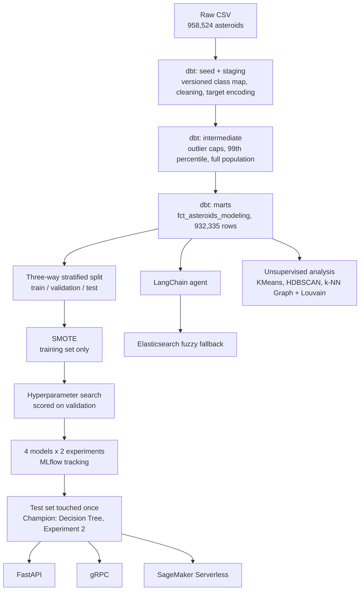

# Orbital Threat Assessment

> Hazardous asteroids, classified from orbital mechanics, explained against NASA's own rule.

                   

An engineering rebuild of a two-person coursework classification project into a production-style pipeline, cloud deployment, and a tool-calling agent.

**INFO 6105 | Data Science Engineering Methods and Tools | Northeastern University**  
Team 20: Venkata Sriya Kamarsu · Akshay Madavalappil Ramesh

---

## Team

| Name | Program |
|---|---|
| **Venkata Sriya Kamarsu** | MS Computer Software Engineering, Northeastern University |
| **Akshay Madavalappil Ramesh** | MS Computer Software Engineering, Northeastern University |

### Contributions

Both members collaborated across all project phases: data preprocessing, exploratory data analysis, feature selection, modelling, evaluation, and report writing.

**Venkata Sriya Kamarsu**
- Led Experiment 1: orbital-only feature set (`e`, `q`, `H`, `neo`, `class`)
- Built and evaluated all four models under the no-MOID constraint
- Conducted hyperparameter tuning and threshold optimization for Experiment 1

**Akshay Madavalappil Ramesh**
- Led Experiment 2: MOID-included feature set (`e`, `q`, `H`, `neo`, `class`, `moid`)
- Built and evaluated all four models with MOID as an additional feature
- Conducted hyperparameter tuning for Experiment 2 and final validation on the full 958K dataset

---

## Overview

Binary classification of potentially hazardous asteroids (PHAs) using orbital mechanics features from NASA JPL's Small-Body Database. The project is structured around a deliberate two-experiment design to investigate the effect of including the Minimum Orbit Intersection Distance (MOID), a feature that is part of NASA's own PHA definition, on model performance and the risk of target leakage.

**Dataset:** 958,524 asteroids from the [NASA JPL Small-Body Database via Kaggle](https://www.kaggle.com/datasets/sakhawat18/asteroid-dataset) (~445 MB CSV, not included in this repo).

*This project was completed as part of INFO 6105 (Data Science Engineering Methods and Tools) at Northeastern University under Prof. Handan Liu, then jointly rebuilt and extended into the production pipeline described throughout this README.*

---

## Repository Contents

| Path | Description |
|---|---|
| `notebooks/pha_analysis.ipynb` | Narrative walkthrough of the rebuilt pipeline and results |
| `dbt/` | Cleaning, encoding, and feature pipeline (DuckDB dev / Snowflake prod targets) |
| `src/otda/` | ML pipeline package: training, tracking, inference, serving, agent |
| `scripts/` | One-off pipeline steps: ingest, train, export, deploy, cloud setup |
| `terraform/` | Snowflake infrastructure as code |
| `airflow/` | Pipeline orchestration (Airflow 3.x, Docker) |
| `elasticsearch/` | Fuzzy asteroid-name search (Docker) |
| `grpc_server/`, `protos/` | gRPC serving layer and its `.proto` contract |
| `tests/` | pytest suite (pipeline invariants, API, agent, gRPC) |
| `RESULTS.md`, `CLUSTERING_RESULTS.md` | Generated results tables and interpretation |

---

## Problem Statement

PHAs are asteroids that come within 0.05 AU of Earth's orbit and have an absolute magnitude H ≤ 22 (implying a diameter large enough to cause regional damage). Out of ~958K catalogued asteroids, fewer than 0.2% qualify, creating a severe class imbalance problem. The goal is to train classifiers that can reliably identify PHAs from orbital parameters, with high recall being the priority (missing a real PHA is worse than a false alarm).

**Class imbalance: 449 non-hazardous asteroids for every 1 PHA.**


---

## Pipeline

This is the current, production pipeline: dbt handles cleaning and features, MLflow tracks every model, and the champion model is served three different ways. The original notebook-only pipeline is preserved as it was submitted in [`legacy/README.md`](legacy/README.md).



---

## Methodology

### Data Preprocessing
- Dropped identifier, uncertainty-sigma, and physical property columns (`diameter`, `albedo`) that would not be available for newly discovered bodies
- Encoded target (`pha`) and near-Earth object flag (`neo`) as binary; asteroid class encoded as category codes
- Stratified 100K sample drawn from the full dataset to keep Colab runtimes feasible
- Outlier capping at the 99th percentile for `a`, `q`, `moid`, and `i`

**Now implemented as a tested dbt lineage graph** (seed, staging, intermediate, marts) instead of pandas cleaning cells, enforced by 20 automated data tests that run in CI. Two real defects were fixed along the way: `class` now comes from a versioned seed instead of `pandas.Categorical.cat.codes` (which silently renumbers every class if the class set ever changes), and rows with an unknown `neo` flag are dropped instead of defaulted to 0. The full 932,335-row cleaned population is now the default; the original 100K stratified sample is kept only as a reproducibility path (see "Corrected Results" below).

### Exploratory Data Analysis

PHA and non-PHA populations occupy distinctly different regions of orbital feature space, particularly in eccentricity and perihelion distance:


The correlation heatmap guided feature selection, revealing redundant columns (`per_y`, `ad`, `n`, `om`, `w`, `ma`, `rms`) that were dropped before modelling:


### Class Imbalance Handling
SMOTE (Synthetic Minority Over-sampling Technique) applied **after** the train/test split and only to the training set, preventing data leakage into evaluation.

### Experiments

| | Experiment 1 | Experiment 2 |
|---|---|---|
| Feature set | `e`, `q`, `H`, `neo`, `class` (orbital only) | Same + `moid` (Min Orbit Intersection Distance) |
| Rationale | Baseline without definitional feature | Adds the feature most correlated with PHA label |
| Key finding | Models learn orbital patterns but struggle with borderline cases | Near-perfect separation; interpretable tree reconstructs NASA's two-condition rule |

### Models
- Logistic Regression (`class_weight='balanced'`, threshold tuning via PR curve)
- Decision Tree (max_depth=4, `class_weight='balanced'`)
- Random Forest (100 estimators, `class_weight='balanced'`)
- LinearSVC (calibrated via `CalibratedClassifierCV` for probability output)

Hyperparameter tuning via `RandomizedSearchCV` with `StratifiedKFold` (5-fold), optimizing for average precision (PR-AUC).

**Now tracked with MLflow** (SQLite-backed): every run's params, metrics, and model artifact are logged, and a proper three-way stratified split (train/validation/test) replaces the original 80/20 split. Hyperparameter search is scored on the held-out validation set, and the test set is touched exactly once per run, in place of the original approach of selecting the winning model directly from test-set numbers.

### Feature Engineering (Explored, Excluded)
Tisserand parameter and orbital energy were computed and evaluated. Both showed weaker correlation with the PHA label than existing features (`e`, `q`) and introduced multicollinearity, so they were excluded from final models.

---

## Key Results

> **Note on metrics:** Accuracy is misleading here due to 449:1 class imbalance. A model that predicts everything as Non-PHA achieves 99.8% accuracy while missing every real threat. **PR-AUC is the primary metric.**

### Experiment 1: Orbital Only (no MOID)

| Model | Recall | Precision | F1 | PR-AUC |
|---|---|---|---|---|
| Logistic Regression | 1.00 | 0.16 | 0.28 | 0.26 |
| Decision Tree | 0.95 | 0.38 | 0.54 | 0.67 |
| Random Forest | 0.77 | 0.37 | 0.50 | 0.36 |
| LinearSVC | 1.00 | 0.16 | 0.28 | 0.25 |


The Decision Tree in Experiment 1 learned to split on perihelion distance and absolute magnitude, the physically meaningful orbital boundaries for Earth-approaching asteroids:


### Experiment 2: MOID Included

| Model | Recall | Precision | F1 | PR-AUC |
|---|---|---|---|---|
| Logistic Regression | 1.00 | 0.28 | 0.43 | 0.62 |
| Decision Tree ★ | 0.98 | 0.98 | 0.98 | 0.99 |
| Random Forest | 0.95 | 0.98 | 0.97 | 0.98 |
| LinearSVC | 1.00 | 0.44 | 0.61 | 0.72 |


> ★ **The Decision Tree independently reconstructed NASA's two-condition PHA definition**, without being told the rule. Root split: `moid ≤ 0.05 AU` (NASA's exact 1st condition). Second split: `H ≤ 22.15` (NASA's exact 2nd condition).


The Random Forest feature importance confirms MOID dominates all other signals once included:


**Final validation on the full 958K dataset** using the best model (Decision Tree, Experiment 2) confirms the results generalize beyond the 100K sample.

### Corrected Results: Full Population (932,335 rows)

The tables above were computed on the 100K stratified sample. Re-running the same two-experiment design on the full cleaned population (932,335 rows after cleaning), with the three-way split described in Methodology instead of selecting the winning model from test-set numbers directly, gives corrected figures that supersede the ones above:

| Feature set | Model | Recall | Precision | F1 | PR-AUC |
|---|---|---|---|---|---|
| Orbital only (no MOID) | Decision Tree | 0.998 | 0.343 | 0.511 | 0.678 |
| **MOID included** | **Decision Tree** | **0.985** | **0.944** | **0.965** | **0.999** |

Full tables for all four models across both experiments, and the reasoning for why MOID makes Experiment 2 near-perfect without it being a leakage artifact, are in [`RESULTS.md`](RESULTS.md).

### Unsupervised Analysis (Secondary)

Independent of the PHA classification task above, do orbital elements alone (`a`, `e`, `i`, `moid`, `H`) recover the known IAU/JPL dynamical classes (Apollo/Amor/Aten/MBA/...)? Ground truth is the `class_code` seed, 13 classes.

| Method | Clusters found | ARI | NMI | Noise fraction |
|---|---|---|---|---|
| KMeans (k=13, full population) | 13 | 0.038 | 0.233 | 0.000 |
| HDBSCAN (100K sample) | 10 | 0.461 | 0.398 | 0.150 |
| k-NN Graph + Louvain (100K sample) | 33 | 0.011 | 0.184 | 0.000 |

None of the three methods fully recover the classes. That's expected, not a failure: the classes are combinatorial threshold regions (Apollo and Amor both require `a > 1.0 AU`; they're separated only by perihelion distance `q` relative to Earth's aphelion), not naturally-separated density clusters. HDBSCAN comes closest because it makes the fewest structural assumptions (no fixed cluster count, no spherical-cluster prior, explicit noise labeling). Full reasoning for each method's specific failure mode is in [`CLUSTERING_RESULTS.md`](CLUSTERING_RESULTS.md).

---

## Design Decisions and Notes

- **MOID as a leakage-adjacent feature:** MOID is part of NASA's official PHA definition, so Experiment 2 is not a typical leakage scenario; it is intentional and documented. The two-experiment structure exists to separate "what can orbital mechanics alone tell us" from "how does the definitional feature change things."
- **CV PR-AUC = 1.0 in Experiment 2:** CV scores on SMOTE-augmented data should not be interpreted as the performance estimate. Held-out test set results are reported as the primary evaluation.
- **Threshold tuning:** For Logistic Regression and LinearSVC in Experiment 1, classification thresholds were tuned using the precision-recall curve to prioritize recall without collapsing precision.

---

## Engineering Rebuild

Beyond the pipeline and methodology above, the model is now served, orchestrated, and reachable through a tool-calling agent.

**Serving**
- FastAPI + Docker, and a **gRPC** service (typed contracts via `protos/pha.proto`): two protocols over the same shared inference module
- Deployed to **AWS SageMaker Serverless Inference** (scales to zero when idle; no dedicated instance to provision or forget to tear down)
- A **LangChain tool-calling agent** that looks up real orbital data and predicts PHA status, grounded in NASA's actual two-condition rule rather than an LLM guess, with an **Elasticsearch** fuzzy-search fallback for misspelled asteroid names
- Optional **DynamoDB** prediction logging, and a genuine async **SQS** batch-scoring pipeline for scoring many objects at once

**Infrastructure**
- **Snowflake** (via Terraform) as a second, additive dbt target and Model Registry entry; DuckDB remains the free, default, CI-tested target
- **Airflow** orchestration (`ingest -> dbt_build -> train -> evaluate`) and GitHub Actions CI (lint + dbt build + pytest) on every push

See [`notebooks/pha_analysis.ipynb`](notebooks/pha_analysis.ipynb) for a narrative walkthrough reading live from this pipeline, and the READMEs under `terraform/`, `airflow/`, `elasticsearch/`, and `grpc_server/` for how each piece was actually verified.

---

## Setup

### Original notebook (Google Colab)

The original notebook was developed in **Google Colab**. To run it:

1. Mount your Google Drive and upload the dataset CSV to `MyDrive/Asteroid_Project.csv`
2. Install the one additional dependency:
   ```bash
   pip install imbalanced-learn
   ```
3. Run cells in order. All other dependencies (scikit-learn, pandas, numpy, matplotlib, seaborn) are pre-installed in Colab.

### Rebuilt pipeline (local + cloud)

Requires the CSV from `legacy/DatasetLink.txt` placed at `data/raw/dataset.csv`.

```bash
python -m venv .venv
.venv/Scripts/pip install -r requirements.txt
.venv/Scripts/pip install -e .

python scripts/ingest_csv_to_duckdb.py --csv path/to/dataset.csv
cd dbt && dbt build --profiles-dir . --project-dir . && cd ..

python scripts/run_experiments.py --dataset full --n-iter 8
python scripts/generate_results_table.py

python scripts/export_champion_model.py
uvicorn otda.api:app --reload        # FastAPI, http://localhost:8000/docs
python -m otda.grpc_server           # gRPC, :50051
python -m otda.agent "Is 433 Eros potentially hazardous?"

pytest tests/ -v
```

Snowflake, AWS (SageMaker/DynamoDB/SQS), Elasticsearch, and Airflow are additive, not required for the above. See `terraform/README.md`, `elasticsearch/README.md`, `airflow/README.md`, and the corresponding scripts under `scripts/` for each.

---

## Dataset

**NASA JPL Small-Body Database**  
Source: https://ssd.jpl.nasa.gov/tools/sbdb_query.html  
Kaggle mirror: https://www.kaggle.com/datasets/sakhawat18/asteroid-dataset  
Format: CSV · Size: ~445 MB · Rows: 958,524

The dataset is not included in this repository.

---

*This project began as the two-person coursework submission described above; the original notebook, report, and images are preserved unmodified under [`legacy/`](legacy/).*
