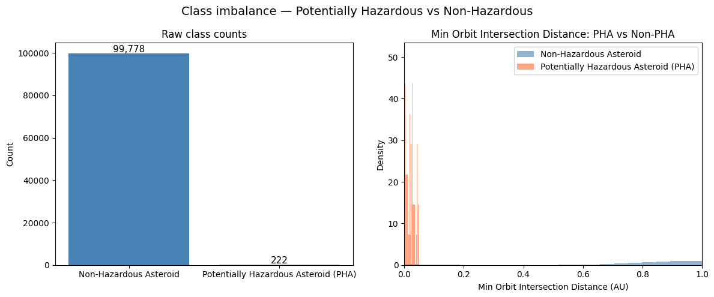
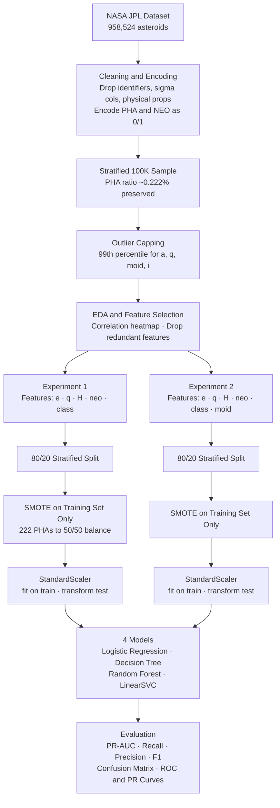
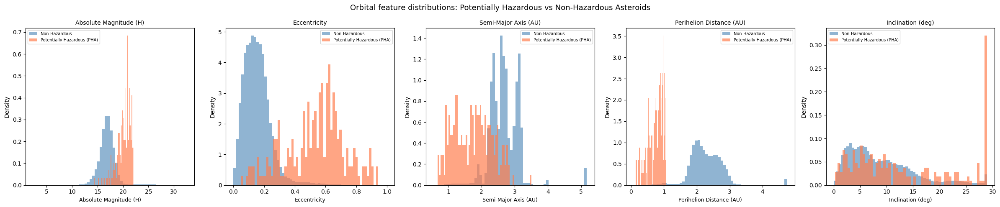
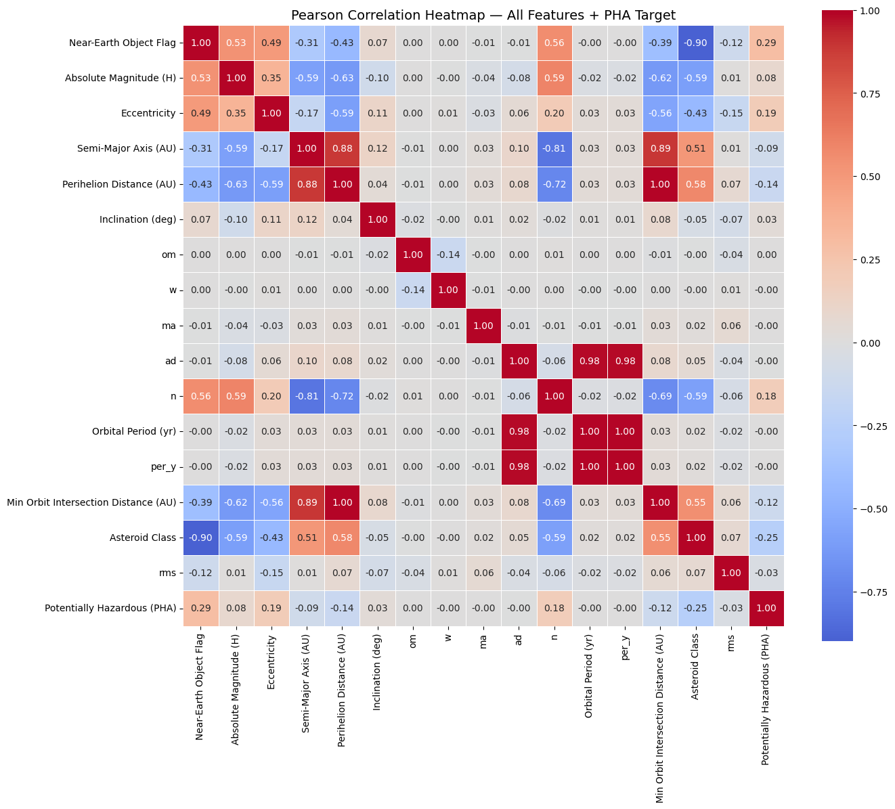
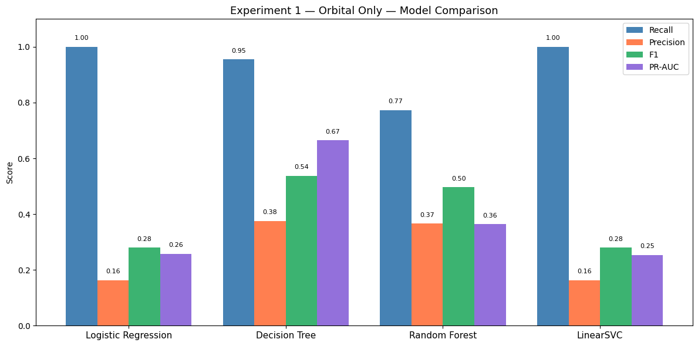
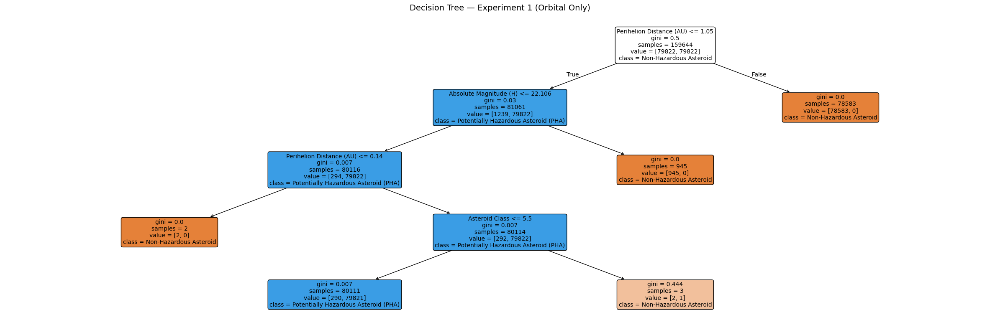
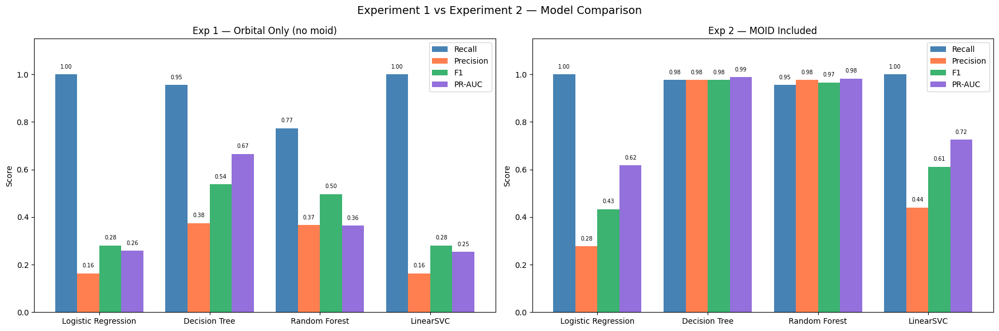
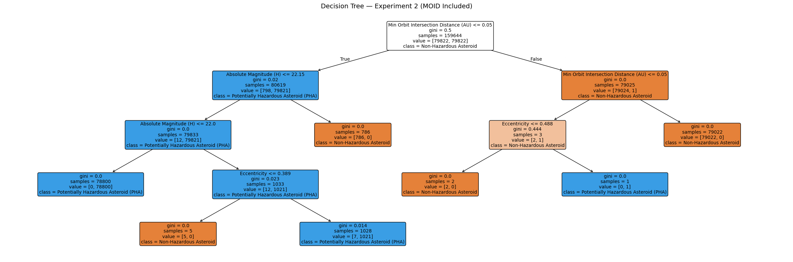
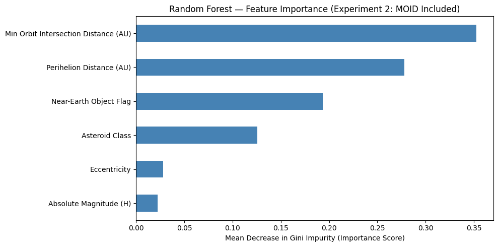

# Orbital Threat Assessment
**INFO 6105 | Data Science Engineering Methods and Tools | Northeastern University**  
Team 20: Venkata Sriya Kamarsu · Akshay Madavalappil Ramesh

---

## Team

| Name | Program |
|---|---|
| **Venkata Sriya Kamarsu** | MS Information Systems, Northeastern University |
| **Akshay Madavalappil Ramesh** | MS Information Systems, Northeastern University |

### Contributions

Both members collaborated across all project phases: data preprocessing, exploratory data analysis, feature selection, modelling, evaluation, and report writing.

**Venkata Sriya Kamarsu**
- Led Experiment 1: orbital-only feature set (`e`, `q`, `H`, `neo`, `class`)
- Built and evaluated all four models under the no-MOID constraint
- Conducted hyperparameter tuning and threshold optimization for Experiment 1

**Akshay Madavalappil Ramesh**
- Led Experiment 2: MOID-included feature set (`e`, `q`, `H`, `neo`, `class`, `moid`)
- Built and evaluated all four models with MOID as an additional feature
- Conducted hyperparameter tuning for Experiment 2 and final validation on the full 958K dataset

---

## Overview

Binary classification of potentially hazardous asteroids (PHAs) using orbital mechanics features from NASA JPL's Small-Body Database. The project is structured around a deliberate two-experiment design to investigate the effect of including the Minimum Orbit Intersection Distance (MOID), a feature that is part of NASA's own PHA definition, on model performance and the risk of target leakage.

**Dataset:** 958,524 asteroids from the [NASA JPL Small-Body Database via Kaggle](https://www.kaggle.com/datasets/sakhawat18/asteroid-dataset) (~445 MB CSV, not included in this repo).

*This project was completed as part of INFO 6105 (Data Science Engineering Methods and Tools) at Northeastern University under Prof. Handan Liu.*

---

## Repository Contents

| File | Description |
|---|---|
| `Project_codeFile.ipynb` | Full pipeline: EDA, preprocessing, modelling, evaluation |
| `Project_Report.docx` | Written report covering methodology, results, and analysis |
| `DatasetLink.txt` | Dataset download link and source details |

---

## Problem Statement

PHAs are asteroids that come within 0.05 AU of Earth's orbit and have an absolute magnitude H ≤ 22 (implying a diameter large enough to cause regional damage). Out of ~958K catalogued asteroids, fewer than 0.2% qualify, creating a severe class imbalance problem. The goal is to train classifiers that can reliably identify PHAs from orbital parameters, with high recall being the priority (missing a real PHA is worse than a false alarm).

**Class imbalance: 449 non-hazardous asteroids for every 1 PHA.**



---

## Pipeline



---

## Methodology

### Data Preprocessing
- Dropped identifier, uncertainty-sigma, and physical property columns (`diameter`, `albedo`) that would not be available for newly discovered bodies
- Encoded target (`pha`) and near-Earth object flag (`neo`) as binary; asteroid class encoded as category codes
- Stratified 100K sample drawn from the full dataset to keep Colab runtimes feasible
- Outlier capping at the 99th percentile for `a`, `q`, `moid`, and `i`

### Exploratory Data Analysis

PHA and non-PHA populations occupy distinctly different regions of orbital feature space, particularly in eccentricity and perihelion distance:



The correlation heatmap guided feature selection, revealing redundant columns (`per_y`, `ad`, `n`, `om`, `w`, `ma`, `rms`) that were dropped before modelling:



### Class Imbalance Handling
SMOTE (Synthetic Minority Over-sampling Technique) applied **after** the train/test split and only to the training set, preventing data leakage into evaluation.

### Experiments

| | Experiment 1 | Experiment 2 |
|---|---|---|
| Feature set | `e`, `q`, `H`, `neo`, `class` (orbital only) | Same + `moid` (Min Orbit Intersection Distance) |
| Rationale | Baseline without definitional feature | Adds the feature most correlated with PHA label |
| Key finding | Models learn orbital patterns but struggle with borderline cases | Near-perfect separation; interpretable tree reconstructs NASA's two-condition rule |

### Models
- Logistic Regression (`class_weight='balanced'`, threshold tuning via PR curve)
- Decision Tree (max_depth=4, `class_weight='balanced'`)
- Random Forest (100 estimators, `class_weight='balanced'`)
- LinearSVC (calibrated via `CalibratedClassifierCV` for probability output)

Hyperparameter tuning via `RandomizedSearchCV` with `StratifiedKFold` (5-fold), optimizing for average precision (PR-AUC).

### Feature Engineering (Explored, Excluded)
Tisserand parameter and orbital energy were computed and evaluated. Both showed weaker correlation with the PHA label than existing features (`e`, `q`) and introduced multicollinearity, so they were excluded from final models.

---

## Key Results

> **Note on metrics:** Accuracy is misleading here due to 449:1 class imbalance. A model that predicts everything as Non-PHA achieves 99.8% accuracy while missing every real threat. **PR-AUC is the primary metric.**

### Experiment 1 — Orbital Only (no MOID)

| Model | Recall | Precision | F1 | PR-AUC |
|---|---|---|---|---|
| Logistic Regression | 1.00 | 0.16 | 0.28 | 0.26 |
| Decision Tree | 0.95 | 0.38 | 0.54 | 0.67 |
| Random Forest | 0.77 | 0.37 | 0.50 | 0.36 |
| LinearSVC | 1.00 | 0.16 | 0.28 | 0.25 |



The Decision Tree in Experiment 1 learned to split on perihelion distance and absolute magnitude, the physically meaningful orbital boundaries for Earth-approaching asteroids:



### Experiment 2 — MOID Included

| Model | Recall | Precision | F1 | PR-AUC |
|---|---|---|---|---|
| Logistic Regression | 1.00 | 0.28 | 0.43 | 0.62 |
| Decision Tree ★ | 0.98 | 0.98 | 0.98 | 0.99 |
| Random Forest | 0.95 | 0.98 | 0.97 | 0.98 |
| LinearSVC | 1.00 | 0.44 | 0.61 | 0.72 |



> ★ **The Decision Tree independently reconstructed NASA's two-condition PHA definition**, without being told the rule. Root split: `moid ≤ 0.05 AU` (NASA's exact 1st condition). Second split: `H ≤ 22.15` (NASA's exact 2nd condition).



The Random Forest feature importance confirms MOID dominates all other signals once included:



**Final validation on the full 958K dataset** using the best model (Decision Tree, Experiment 2) confirms the results generalize beyond the 100K sample.

---

## Design Decisions and Notes

- **MOID as a leakage-adjacent feature:** MOID is part of NASA's official PHA definition, so Experiment 2 is not a typical leakage scenario; it is intentional and documented. The two-experiment structure exists to separate "what can orbital mechanics alone tell us" from "how does the definitional feature change things."
- **CV PR-AUC = 1.0 in Experiment 2:** CV scores on SMOTE-augmented data should not be interpreted as the performance estimate. Held-out test set results are reported as the primary evaluation.
- **Threshold tuning:** For Logistic Regression and LinearSVC in Experiment 1, classification thresholds were tuned using the precision-recall curve to prioritize recall without collapsing precision.

---

## Setup

This notebook was developed in **Google Colab**. To run it:

1. Mount your Google Drive and upload the dataset CSV to `MyDrive/Asteroid_Project.csv`
2. Install the one additional dependency:
   ```bash
   pip install imbalanced-learn
   ```
3. Run cells in order. All other dependencies (scikit-learn, pandas, numpy, matplotlib, seaborn) are pre-installed in Colab.

---

## Dataset

**NASA JPL Small-Body Database**  
Source: https://ssd.jpl.nasa.gov/tools/sbdb_query.html  
Kaggle mirror: https://www.kaggle.com/datasets/sakhawat18/asteroid-dataset  
Format: CSV · Size: ~445 MB · Rows: 958,524

The dataset is not included in this repository.
